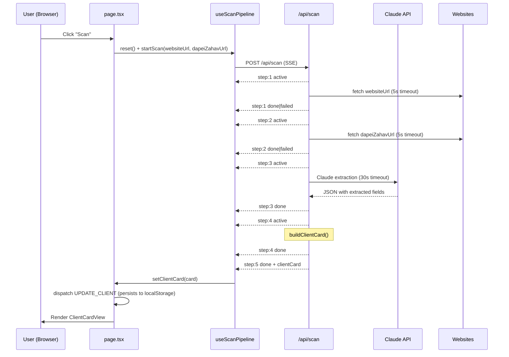

# AI Scan Flow

**Created:** 2026-04-09
**Last Updated:** 2026-04-09
**Version:** 1.0.0
**Status:** Complete

## Overview

The AI scan flow is triggered from a client's detail page. It fetches and analyzes the client's digital assets (website and/or Dapei Zahav listing), extracts structured data via Claude, and saves the result as a persistent `ClientCard`. The entire flow is streamed over SSE so the UI updates in real time as each step completes.

---

## Entry Points

- User navigates to `/clients/[id]`
- Client status is `ממתין` (Pending) or `סורק` (Scanning)
- Scan CTA panel is visible (only when `!showPipeline && !displayCard`)
- User clicks "סרוק נכסים דיגיטליים" (Scan digital assets)

---

## Flow Steps

### Step 1 — Website fetch
- Server fetches `websiteUrl` with a 5-second timeout
- Strips `<script>`, `<style>`, HTML tags, decodes entities, truncates to 8 000 chars
- Status: `done` if text extracted, `failed` if unreachable/timeout

### Step 2 — Dapei Zahav fetch
- Same process for `dapeiZahavUrl`
- Status: `done` if text extracted, `failed` if missing/unreachable

### Step 3 — AI analysis
- Combined extracted texts sent to Claude (`claude-haiku-4-5-20251001`)
- Prompt instructs extraction of: businessName, ownerName, businessType, area, description, contactInfo, services
- 30-second timeout; responses capped at 1 024 tokens
- JSON parsed from response; `services` validated as array

### Step 4 — Build client card
- `buildClientCard()` maps `ExtractedClientData` → `ClientCard`
- `digitalAssets` built from whichever URLs were provided

### Step 5 — Done
- Final `clientCard` object delivered in the SSE `step: 5` event
- Frontend stores it in state and dispatches `UPDATE_CLIENT` to context

---

## Demo Mode Paths

| Condition | Behavior |
|---|---|
| `DEMO_MODE=true` or no `ANTHROPIC_API_KEY` | Full simulation — all 5 steps animate with delays using `MOCK_AC_TECHNICIAN_CARD` |
| Both URL fetches fail (texts.length === 0) | Steps 1 & 2 show `failed`; only steps 3-5 animate, then demo card |
| Claude API call fails | Step 3 shows `failed`; step 4 & 5 complete with demo card |

---

## Sequence Diagram

---

## Error Paths

| Error | Handling |
|---|---|
| Malformed POST body | Returns HTTP 400 before streaming starts |
| Private/loopback URL (SSRF) | URL silently nulled out; treated as not provided |
| Website unreachable / timeout | Step 1 or 2 marked `failed`; scan continues with available data |
| Both URLs fail | Steps 3-5 animate with demo card |
| Claude timeout / API error | Step 3 marked `failed`; demo card returned for steps 4-5 |
| Network error on client | `AbortError` silently swallowed; scan UI stays in last known state |
| Component unmount during scan | `AbortController.abort()` called; reader loop exits cleanly |

---

## State Effects

After step 5 completes:
1. `useScanPipeline.clientCard` is set
2. `page.tsx` `useEffect([clientCard, client?.id])` fires
3. Dispatches `UPDATE_CLIENT` → merges `{ clientCard, status: 'מוכן' }` into client state
4. Client status changes to `מוכן` in the dashboard
5. `ClientCardView` renders in the detail page
6. Full client array written to `localStorage`

---

## Related Documentation

- [Client Detail Screen](../screens/client-detail-page.md)
- [AI Scan Engine Feature](../features/ai-scan-engine.md)
- [API: POST /api/scan](../api/scan-endpoint.md)
