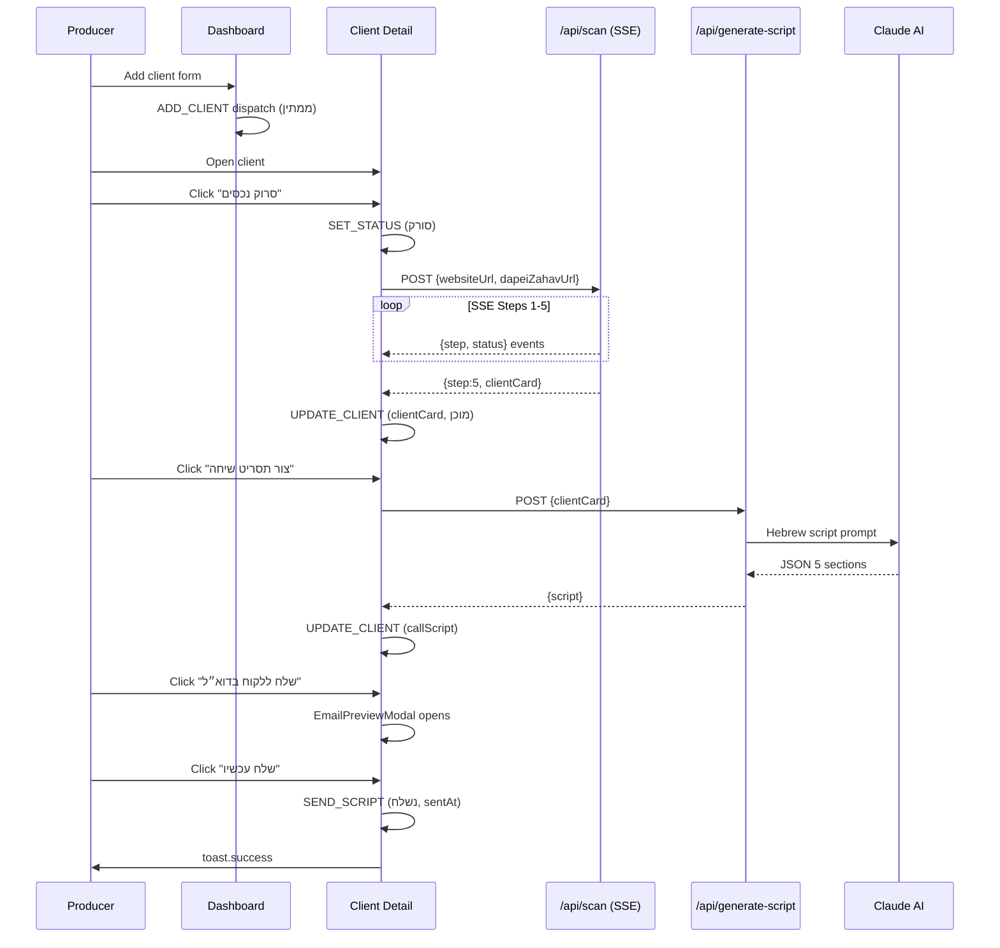

# Client Onboarding Flow

**Created:** 2026-04-09
**Last Updated:** 2026-04-09
**Version:** 1.0.0
**Status:** Complete

## Overview

End-to-end flow a producer follows to take a new client from creation through to sending their onboarding call script. Covers adding the client, triggering the AI scan, reviewing the client card, generating a personalized script, and "sending" it.

---

## Entry Points

- Producer clicks "הוסף לקוח" on the dashboard (`/clients`)
- Producer opens an existing ממתין client from the dashboard

---

## Step-by-Step Flow

### 1. Add Client

**Screen:** Dashboard (`/clients`)
**Component:** `AddClientDialog` button opens a dialog form

Producer fills in:
- שם עסק (required)
- כתובת אתר (optional)
- כתובת דפי זהב (optional)
- אזור (optional)
- סוג עסק (optional)
- הערות (optional)

On submit: `ADD_CLIENT` dispatched to context → client created with `status: 'ממתין'`, `id: nanoid()`, `createdAt: ISO string`.

---

### 2. Open Client Detail

**Screen:** Client detail (`/clients/[id]`)
**Components:** `TopBar` (with back arrow), header card, digital assets section

Producer clicks the client row → navigates to `/clients/[id]`. Header shows business name, type, area, status badge, and creation date.

---

### 3. Trigger Scan

**Component:** Scan CTA block (shown when `!showPipeline && !displayCard`)

Producer clicks "סרוק נכסים דיגיטליים":
1. `reset()` clears previous scan state
2. `SET_STATUS` dispatched → `status: 'סורק'`
3. `startScan(websiteUrl, dapeiZahavUrl)` called → POST to `/api/scan`

---

### 4. Scan Pipeline Animates (SSE)

**Component:** `ScanPipeline` (shown while `showPipeline` is true)

5 steps animate in real-time via SSE:

| Step | Label |
|---|---|
| 1 | סריקת האתר |
| 2 | סריקת דפי זהב |
| 3 | ניתוח AI |
| 4 | בניית כרטיס לקוח |
| 5 | הכנת הכרטיס |

Each step shows `active` (spinner) → `done` (checkmark) or `failed` (X).

**On complete:** `clientCard` appears in hook state → `useEffect` fires → `UPDATE_CLIENT` dispatched with `{ clientCard, status: 'מוכן' }`.

---

### 5. Review Client Card

**Component:** `ClientCardView`

Displays extracted data:
- Business name, owner, type, area, description
- Contact info (phone/email/address with copy buttons)
- Services list
- Digital assets with scan status badges

If the scan used demo data, `usedDemoData: true` shows a "נתוני דמו" badge.

Producer can re-scan by clicking "סרוק מחדש" (shown when `canScan` is true).

---

### 6. Generate Call Script

**Component:** `CallScriptGenerateButton` (shown when `!displayScript && canGenerateScript`)

`canGenerateScript = displayCard !== null && (client.status === 'מוכן' || client.status === 'נשלח')`

Producer clicks "צור תסריט שיחה":
1. `CallScriptLoadingState` shown (pulsing placeholder)
2. POST to `/api/generate-script` with `clientCard`
3. Claude Opus generates 5-section JSON
4. Script stored in hook state + `UPDATE_CLIENT` dispatched with `{ callScript: script }`

---

### 7. Review Script

**Component:** `CallScriptCard`

Displays 5 sections with orange left-border headers:
- פתיחה
- מטרת השיחה
- סקירת הנכסים הדיגיטליים
- הצעדים הבאים
- סגירה חמה

If demo data used, a banner indicates it.

---

### 8. Send via Email

**Components:** `CallScriptCard` → `EmailPreviewModal`

Producer clicks "שלח ללקוח בדוא״ל":

**Email Preview Modal opens:**
- Chrome bar: "זאפ מייל — תצוגה מקדימה"
- From: `onboarding@zap.co.il`
- To: client email (or fallback)
- Subject: `ברוך הבא לזאפ – {businessName}`
- Body: greeting + 5 script sections + footer

Producer clicks "שלח עכשיו →":
1. 1.5s sending animation (spinner + "שולח...")
2. Modal closes
3. `onSend(sentAt)` called in `CallScriptCard`
4. `onSend` propagates up to `page.tsx`
5. `SEND_SCRIPT` dispatched → `status: 'נשלח'`, `sentAt: ISO string`
6. `toast.success(...)` shown via sonner

---

## Error Paths

| Scenario | Behavior |
|---|---|
| Scan fails (both URLs) | Steps 1-2 show `failed`; steps 3-5 proceed with demo card |
| Claude extraction fails | Step 3 `failed`; card built with demo data |
| Script generation fails | Error message shown; "נסה שוב" lets producer retry |
| No client found at URL | `ClientPage` renders "לקוח לא נמצא" with link back |

---

## Sequence Diagram

---

## Related Documentation

- [AI Scan Flow](./ai-scan-flow.md)
- [Dashboard Screen](../screens/dashboard.md)
- [Client Detail Screen](../screens/client-detail.md)
- [Client Status Workflow](../statuses/client-status-workflow.md)
- [Call Script Generation Feature](../features/call-script-generation.md)
- [API: POST /api/scan](../api/scan-endpoint.md)
- [API: POST /api/generate-script](../api/generate-script-endpoint.md)
