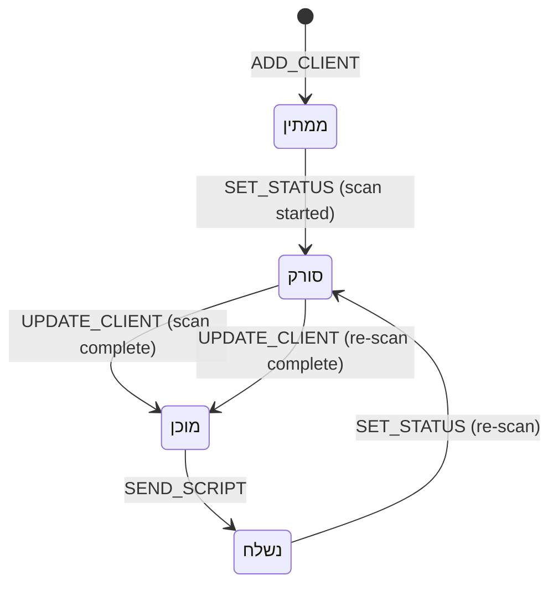

# Client Status Workflow

**Created:** 2026-04-09
**Last Updated:** 2026-04-09
**Version:** 1.0.0
**Status:** Complete

## Overview

Each client moves through a four-stage status pipeline. Status drives what UI is shown on the client detail page and how the client row appears in the dashboard.

---

## Status Values

```typescript
type ClientStatus = 'ממתין' | 'סורק' | 'מוכן' | 'נשלח';
```

| Status | Hebrew | Meaning |
|---|---|---|
| `ממתין` | Pending | Client created; scan not yet started |
| `סורק` | Scanning | AI scan pipeline is running |
| `מוכן` | Ready | Scan complete; client card available |
| `נשלח` | Sent | Call script generated and email sent |

---

## State Machine



---

## Valid Transitions

| From | To | Trigger | Dispatch |
|---|---|---|---|
| — | `ממתין` | Producer adds client | `ADD_CLIENT` |
| `ממתין` | `סורק` | Producer clicks scan | `SET_STATUS` |
| `סורק` | `מוכן` | Scan pipeline completes | `UPDATE_CLIENT { clientCard, status: 'מוכן' }` |
| `מוכן` | `נשלח` | Producer sends email | `SEND_SCRIPT { sentAt }` |
| `מוכן` | `סורק` | Producer clicks re-scan | `SET_STATUS` |
| `נשלח` | `סורק` | Producer clicks re-scan | `SET_STATUS` |

Re-scanning a `נשלח` client is allowed — the producer may want to refresh the card and regenerate the script.

---

## Context Actions

**File:** `src/context/ClientsContext.tsx`

```typescript
type Action =
  | { type: 'ADD_CLIENT'; client: Client }
  | { type: 'UPDATE_CLIENT'; id: string; updates: Partial<Client> }
  | { type: 'SET_STATUS'; id: string; status: ClientStatus }
  | { type: 'DELETE_CLIENT'; id: string }
  | { type: 'SEND_SCRIPT'; id: string; sentAt: string };
```

### `SEND_SCRIPT`

Sets `status: 'נשלח'` and `sentAt` on the client:

```typescript
case 'SEND_SCRIPT':
  return state.map((c) =>
    c.id === action.id ? { ...c, status: 'נשלח', sentAt: action.sentAt } : c
  );
```

`sentAt` is an ISO 8601 string generated client-side at send time.

### `UPDATE_CLIENT`

Used to persist `clientCard` and `callScript` after they are generated:

```typescript
case 'UPDATE_CLIENT':
  return state.map((c) =>
    c.id === action.id ? { ...c, ...action.updates } : c
  );
```

---

## UI Behavior Per Status

### Dashboard (`ClientTable`)

| Status | Dot color | Header bg | Row hover |
|---|---|---|---|
| ממתין | amber | amber-50 | amber-50/40 |
| סורק | blue | blue-50 | blue-50/40 |
| מוכן | emerald | emerald-50 | emerald-50/40 |
| נשלח | orange | orange-50 | orange-50/40 |

Date column shows:
- `נשלח` → `sentAt` formatted as DD/MM/YYYY
- All others → `createdAt` formatted as DD/MM/YYYY

### Client Detail Page

| Status | Scan CTA | Script section | Re-scan button |
|---|---|---|---|
| `ממתין` | Shown (enabled) | Hidden | Hidden |
| `סורק` | Hidden | Hidden | Hidden (pipeline shown) |
| `מוכן` | Hidden | Shown | Shown |
| `נשלח` | Hidden | Shown (script view only) | Shown |

`canGenerateScript = displayCard !== null && (status === 'מוכן' || status === 'נשלח')`

---

## Data Model

```typescript
interface Client {
  id: string;
  businessName: string;
  websiteUrl?: string;
  dapeiZahavUrl?: string;
  status: ClientStatus;
  createdAt: string;        // ISO 8601
  sentAt?: string;          // ISO 8601 — set on SEND_SCRIPT
  notes?: string;
  area?: string;
  businessType?: string;
  clientCard?: ClientCard;  // set on UPDATE_CLIENT after scan
  callScript?: CallScriptSection[]; // set on UPDATE_CLIENT after generate
}
```

---

## Persistence

All status changes are persisted to `localStorage` via the `ClientsContext` `useEffect`:

```typescript
useEffect(() => {
  localStorage.setItem('zap-crm-clients', JSON.stringify(clients));
}, [clients]);
```

---

## Related Documentation

- [Client Onboarding Flow](../flows/client-onboarding-flow.md)
- [Architecture: State Management](../architecture/state-management.md)
- [Dashboard Screen](../screens/dashboard.md)
- [Client Detail Screen](../screens/client-detail.md)
